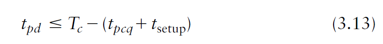

# Sequential logic
## Latch and FlipFlop

## Setup Time

Tpcq is settled by hardware, and so is Tsetup. There are two types of constraints:  
* Setup time constraint:  
  
* Hold time Constraint  

