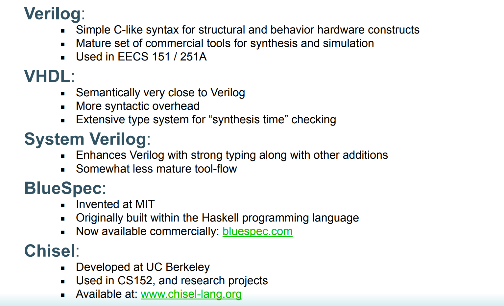
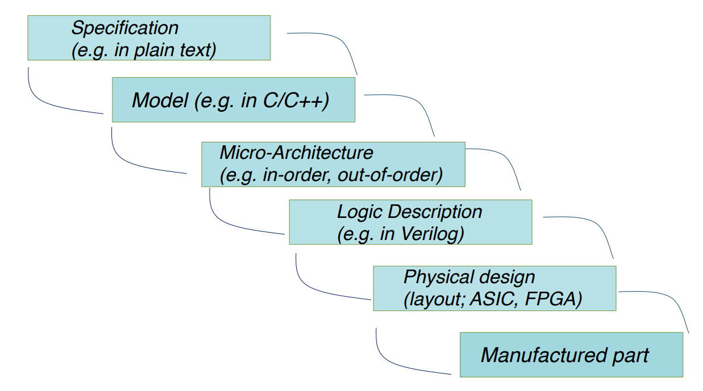

# Verilog  
Verilog is a hardware description language that is mostly used nowadays. Following picture shows the outlines of several typical tools/languages to describe hardware.

## Verilog compile pass
Logic synthesis, the process of lowering **Verilog hdl to Gate-Level netlists**. Following picture summarizes the whole pass: 
 

## HDLBits practice
[HDLBits](https://hdlbits.01xz.net/) is a website that we can learn and practice basic verilog language structures, designs. It integrate Quartus compile and simulation.