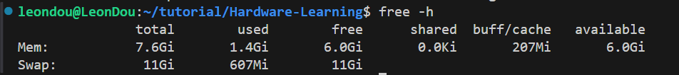

# 如何构建项目？  
此文件是说明如何从源码构建一个项目（LLVM，MLIR，verilator等项目都涉及源码构建）。
## 构建工具
* ninja
* makefile
* cmake
## 交换空间
> Swap space in Linux is used when the amount of physical memory (RAM) is full. If the system needs more memory resources and the RAM is full, inactive pages in memory are moved to the swap space. While swap space can help machines with a small amount of RAM, it should not be considered a replacement for more RAM. Swap space is located on hard drives, which have a slower access time than physical memory.Swap space can be a dedicated swap partition (recommended), a swap file, or a combination of swap partitions and swap files.  

### 查看内存空间
使用`free -h`命令可以查看swapspace。
  

### Linux下如何快速管理swapspace？  
1. 如果已有swapspace，先禁用  
    ```shell
    sudo swapoff /swapfile
    ```
2. 删除旧的swapspace文件
    ```shell
    sudo rm /swapfile
    ```
3. 创建新文件，并设置权限
    ```shell
    sudo fallocate -l 4G /swapfile
    sudo chmod 600 /swapfile             # 设置权限
    ```
4. 启用swapspace
    ```shell
    sudo mkswap /swapfile                # 把文件设为swap
    sudo swapon /swapfile                # 启用swap
    ```