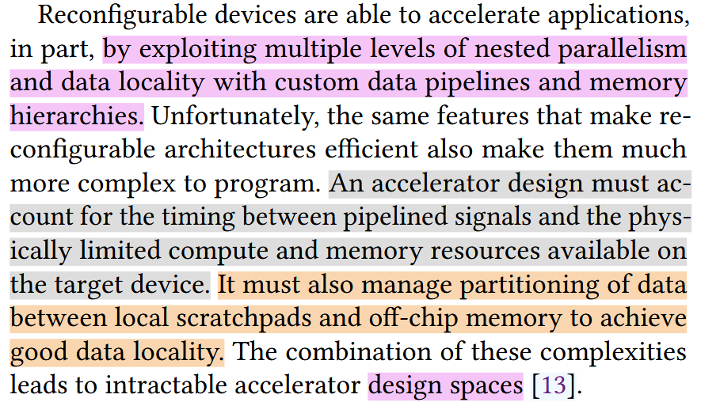

# Spatial: a domain specific compiler
> This repo is about DSE design in fpga fields. The topic comes from PLDI2020 tutorial.

## Why spatial? 
> This compiler aims to support great optimization during the process of accelerate FPGA design.

### Current difficulties
FPGA and CRGAs (coarse-grain reconfigurable architectures), are more and more widely used in datacenters, due to their **potential performance** and **energy efficiency**.  

so the key point is, how to solve DSE (**design space exploration problem**)?

### Current WorkFlow for FPGA design
1. hand tune kernel code
2. HDL languages
3. HLS tools, for example [xilinx-SDAccel](https://www.xilinx.com/publications/prod_mktg/sdx/sdaccel-backgrounder.pdf)

### Spatial features
* it can describe hardware architecture, being aware of memory, cache and all sort of that to auto-optimize
* integrate automated design parameter space exploration using HyperMapper
* an ir that is targetagnostic, and all sort of optimization passes

## References
1. [Spatial essay](https://dl.acm.org/doi/10.1145/3192366.3192379)
2. [PLDI2020 tutorial](https://www.youtube.com/watch?v=0S-y7uCY93Q&t=10484s)
3. [SDAccel](https://www.xilinx.com/publications/prod_mktg/sdx/ sdaccel-backgrounder.pdf.)