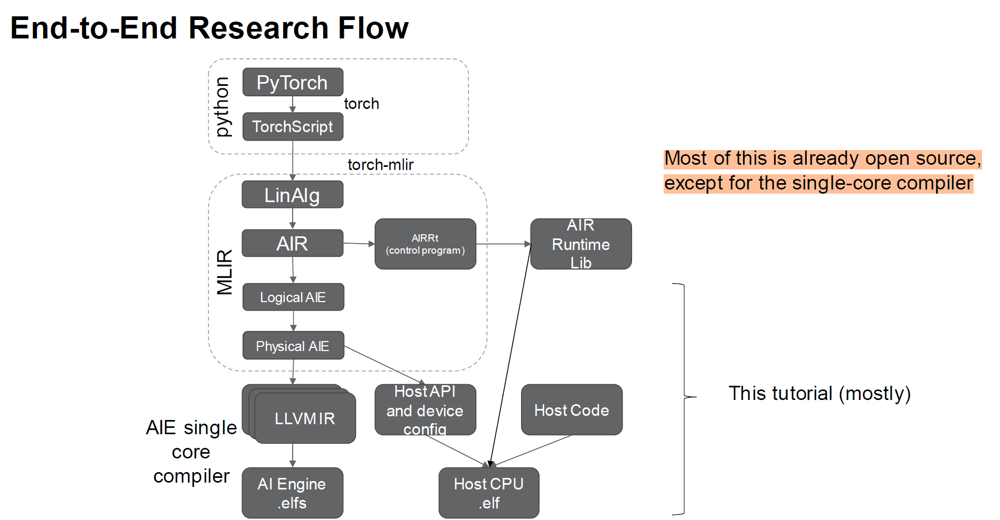
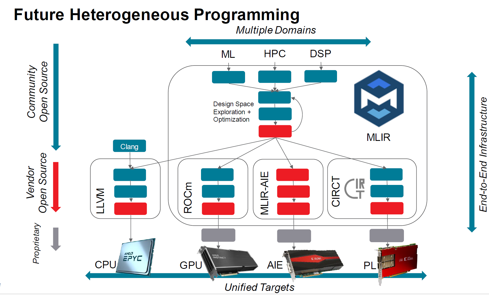

# MLIR-AIE 
## [AI Engine architecture](./arch.md)  
This subrepo contains descritpions of AMD AI engine architecture.

## [MLIR-AIE tutorial](./tutorial.md)
This subrepo is simply a guideline for [MLIR-AIE tutorial](./tutorial.md). 
1. Intro to MLIR and AIEngine  
2. Physical MLIR-AIE
3. Host Code, Simulation and Performance Counters
4. Logical MLIR-AIE: Communication  
5. Advanced Topics

## Work Flow of MLIR-AIE  

* [Physical MLIR-AIE](./Physical_mlir.md)

## Future of MLIR-AIE 

## References 
1. [MLIR-AIE talk](https://www.c4ml.org/)
2. [MLIR-AIE github官网](https://github.com/Xilinx/mlir-aie)
3. [MLIR-AIE build指南](https://xilinx.github.io/mlir-aie/Building.html)
4. [ASPLOS workshop](https://github.com/Xilinx/mlir-aie/blob/main/docs/conferenceDescriptions/asplos24TutorialDescription.md)
5. [Versal AIE手册](https://docs.amd.com/r/en-US/am020-versal-aie-ml/Overview)
6. [AIE slides](https://www.xilinx.com/content/dam/xilinx/publications/presentations/leveraging-mlir-to-design-for-aie-fpga-2023.pdf)
7. [AIE arch talk](https://www.youtube.com/watch?v=bNTeob7KfiQ)
