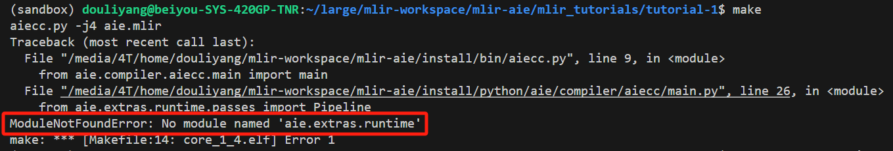
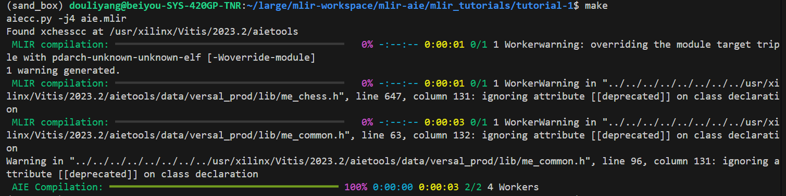

# MLIR-AIE项目构建  
## Build流程
1. 安装Prerequest
    ```shell
    lld
    cmake 3.20.6
    ninja 1.8.2
    Xilinx Vitis 2023.2
    python 3.8.x and pip
    virtualenv
    pip3 install psutil rich pybind11 numpy
    clang/llvm 14+ from source https://github.com/llvm/llvm-project 
    ```  
2. [安装Vitis](../../../EDA/Vitis/build.md)    
    注意，构建好Vitis项目后（比如在），运行`/usr/xilinx/Environment_Bash/AIE.sh`脚本，**会导致PATH环境中添加cmake 3.3.2版本，与本项目的3.20+要求冲突**。。因此选择手动添加所需要的Vitis安装路径到PATH中即可。
3.  利用脚本安装prerequisite  
    ```shell
    source /utils/setup_python_packages.sh
    ```  
    > 官网说需要virtualenv，但是脚本中实际使用的是python venv, 需要自行针对修改。
4. clone项目   
    ```shell
    git clone --recurse-submodules https://github.com/Xilinx/mlir-aie.git
    cd mlir-aie
    ```     
    后续操作就都在/mlir-aie路径下操作。 
5. clone llvm
    ```shell  
    ./utils/clone-llvm.sh
    ```
6. build llvm  
    ```shell  
    ./utils/build-llvm-local.sh
    ``` 
    上述命令是构建在llvm项目下的/install中，如果有root权限，可以make install到系统环境中。该脚本配置的是19.0.0版本llvm。
7. build mlir-aie（非VCK5000系统，没有Rocm）  
    ```shell    
    source <Vitis Install Path>/settings64.sh
    ./utils/build-mlir-aie.sh <llvm dir>/<build dir>
    ```   
8. 添加mlir-aie以及llvm环境到环境变量  
    ```shell
    source utils/env_setup.sh <mlir-aie>/install <llvm dir>/install
    ```  
    运行上述脚本，如果没有构建llvm-aie项目，脚本会http在线下载llvm-aie，比较慢。选择自行手动下载whl文件或是源码编译，并提供llvm-aie的install路径即可。  
    > <font color = red>注意，由于使用virtualenv虚拟环境，所以慎用相对路径。</font>  
9. 检查build是否成功:  
    可以通过`echo $PATH`看环境。`aie-opt --version`等check

## Bug修复  
### MLIR-PYTHON_BINDING问题  
在学习tutorial-1中，需要运行aiecc.py，发现如下报错：  


查看mlir-aie的issue，发现mlir-aie已经将mlir-python-extras从repo中移除，转而用添加依赖的方式安装mlir-python-extras。具体见[Use mlir-python-extras as a dependency](https://github.com/Xilinx/mlir-aie/pull/1828)。因此有两种方式来解决该问题：  
1. 回退版本，变为extras在repo中。回退到fc6dca2a即可。  
2. 检查构建requirements中的依赖配置，重新配置虚拟环境。  

我选择重新构建，发现调用的`setup_python_packages.sh`中，pip install了`requirements.txt`以及`requirements_extra.txt`，而`mlir-python-extras`在`requirements_extra.txt`中。  
修改其中的https路径为ssh路径即可。  
```txt   
 # This can't go in the normal requirements file because the way the wheels build parses requirements.txt
 # does not support github packages
git+ssh://git@github.com/makslevental/mlir-python-extras.git@b2b8d72
```   

在新的环境下运行tutorial-1，可以看到如下结果：    


### 生成面向aarch架构的可执行，clang报没有target  
这个错误比较容易修复，关键问题是我自己从llvm-aie官网下的weel包，只支持aie，x86，没有支持我们需要的aarch64。只需要替换llvm-aie为源码，并做源码编译即可解决。


