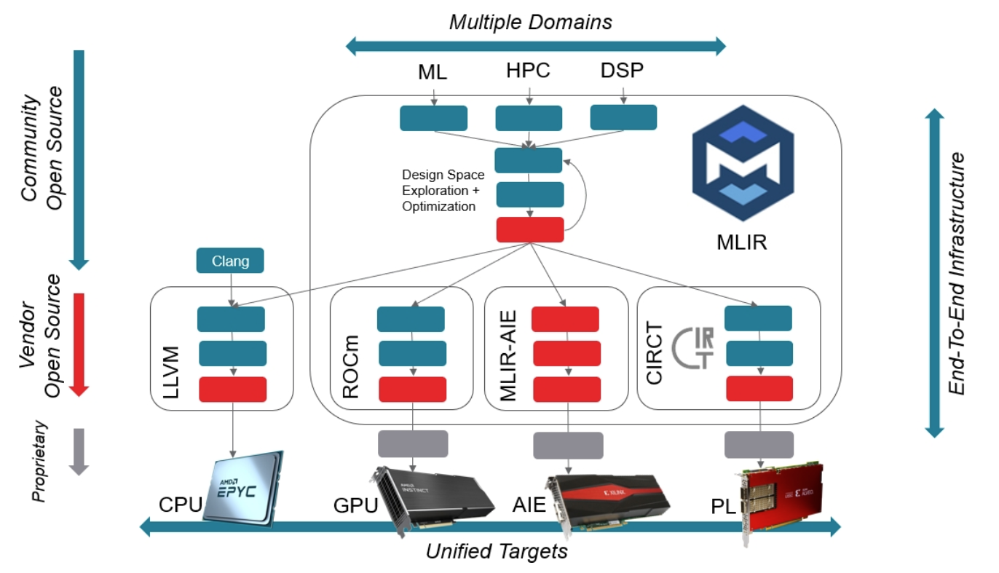
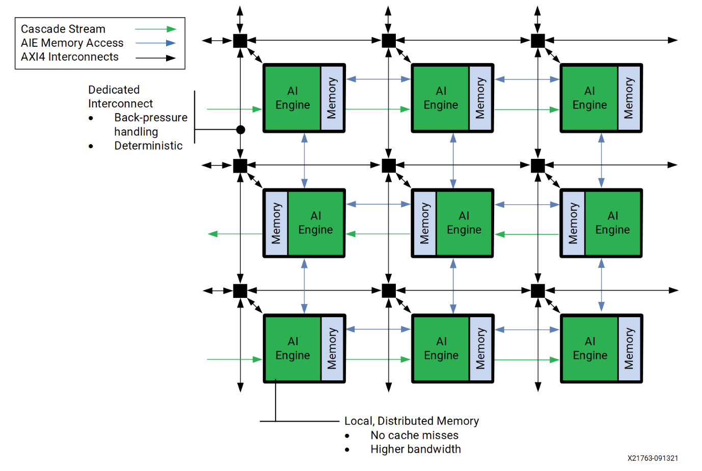
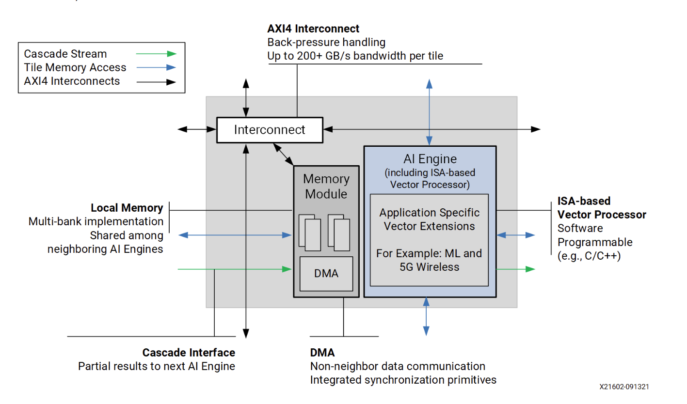

# MLIR-based AI Engine Design Tutorial  

## Chapter0. Intro
### General View 
  
mlir-aie框架可以生成VERSAL开发板上的低层级配置，包括**处理器**，**流交换单元**，**单元DMA模块**，以及**shimDMA单元**。backend gen阶段，生成面向**LibXAIE库**的代码。生成的配置代码是由**主机代码**来运行的。主机代码和ai引擎间的控制是由`aie/runtime_lib`来交互的。  

### AI engine  
AI 引擎是阵列处理机，有多个2D排列的处理机：  
  
上图中的每个ai-engine的架构细节如下：

## References  
1. [mlir-aie intro](https://github.com/Xilinx/mlir-aie/tree/main/mlir_tutorials)
2. [mlir-aie dialect](https://xilinx.github.io/mlir-aie/AIEDialect.html)

