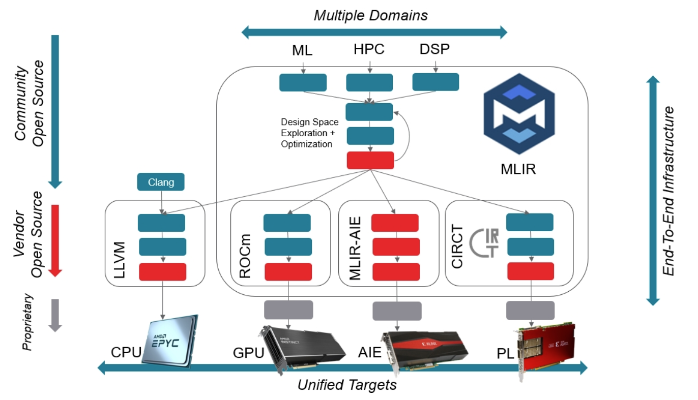
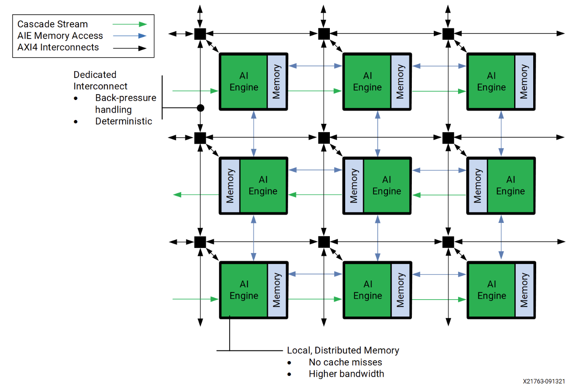
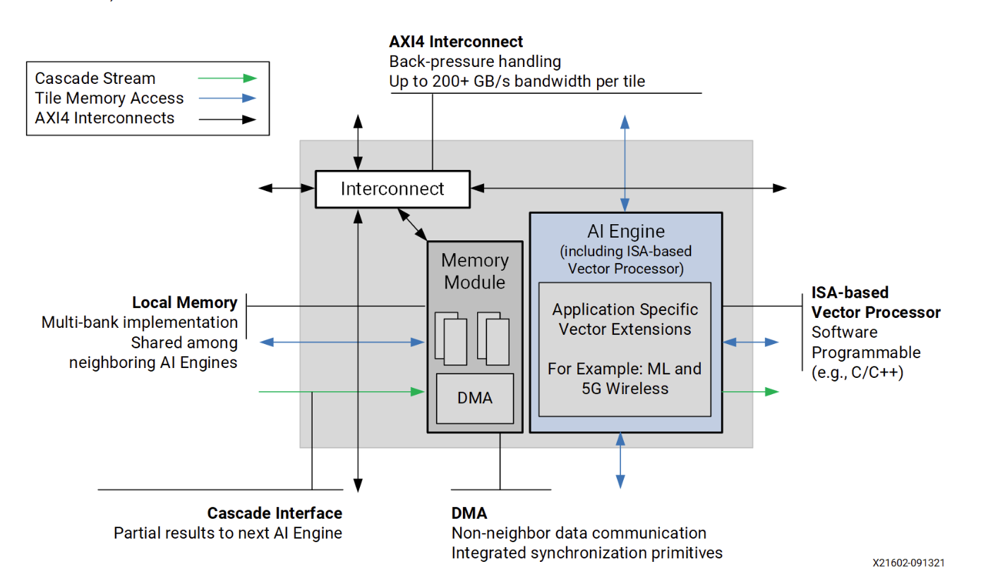

# MLIR-based AI Engine Design Tutorial  

## Chapter0. Intro
### General View 
  
mlir-aie框架可以生成VERSAL开发板上的低层级配置，包括**处理器**，**流交换单元**，**单元DMA模块**，以及**shimDMA单元**。backend gen阶段，生成面向**LibXAIE库**的代码。生成的配置代码是由**主机代码**来运行的。主机代码和ai引擎间的控制是由`aie/runtime_lib`来交互的。  

### AI engine  
AI 引擎是阵列处理机，有多个2D排列的处理机：  
  
上图中的每个ai-engine的架构细节如下：
   
AI引擎的一个核心是，芯片之间的**互联**。VERSAL框架支持三种互联方式：  
1. Local Memory   
在本地内存方面，每个AI引擎都能够访问其四个主要方向（上下左右）邻居的本地内存。这种通信方式具有最高的带宽，因为第一代AI引擎每个周期可以进行2次256位的加载和1次256位的存储。
2. Stream Switch    
AI引擎之间的第二种通信方式是流交换，通过流交换网络在整个AI引擎阵列内传输数据，每流每周期可达32位。数据可以电路交换或分组交换的方式从源AIE单元传到目标单元，并**可直接连接到AIE单元的流端口或通过DMA读写**。此方法适用于非相邻单元间的数据传输，也是数据进出AI引擎阵列的唯一方式。
3. Cascade  
级联流是一种宽数据通道（每周期384位），用于在AI引擎的水平方向上相邻单元之间传输数据。数据传输方向**呈蛇形**：偶数行从右到左，奇数行从左到右。在偶数行的最左端和奇数行的最右端，数据会向上连接到下一行。例如，第1行最右侧单元连接到第2行最右侧，第2行最左侧则连接到第3行最左侧。

## References  
1. [mlir-aie intro](https://github.com/Xilinx/mlir-aie/tree/main/mlir_tutorials)
2. [mlir-aie dialect](https://xilinx.github.io/mlir-aie/AIEDialect.html)

