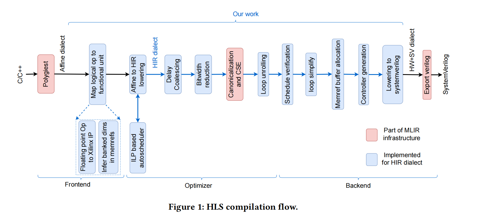

# HIR essay  
## Why HIR?
To start with this paper, before diving into details of the HIR compiler design principles, we should always try to ask ourselves, why we need HIR?  
> Why HIR?
Machine learning emerges, which makes FPGA an ideal hardware to work on to do **ai acceleration**(Low energy consumption and quite good performance). HIR aims to solve following questions: (1) difficulty of hardware design. (2) Lack of vendor argonostic (3) standardized hardware compilation infrastructure.     

### DSL vs. HLS 
>**DSL** stands for domain specific languages and **HLS** stands for high level synthesis. To answer why HIR is good, first we need to understand DSL(HIR belongs to DSL) over HLS(tradition way of lower C/C++/SystemC to verilog/vhdl).  

*How DSL do?*  
DSL tailor HLS for certain domain. DSL is easy for software programmer to use!ss  

*HLS examples* 
1. [Xilinx Vitis HLS](https://www.amd.com/en/products/software/adaptive-socs-and-fpgas/vitis/vitis-hls.html)
2. [Cadence C-to-silicon](https://community.cadence.com/cadence_blogs_8/b/fv/posts/c-to-silicon-compiler-is-a-high-level-and-a-low-level-synthesis-tools)
3. [Synopsys Synphony](https://news.synopsys.com/home?item=123096)
4. [Mentor Graphics Catapult HLS](https://eda.sw.siemens.com/en-US/ic/catapult-high-level-synthesis/)

### Highlights and Restrictions of HIR  
*Highlights*  
1. MLIR based, **less software fragmentations** and **more shared optimization framework**
2. Use **datapath + schedule** to represent hardware. Enable automatic synthesis and synchronization-free, fine-grained scheduling. 
    > explicit scheduling plus some high level language abstraction make the second highlight possible.

*Restrictions*  
1. Only affine-workloads 

### Why MLIR?  
> In this work, we attempt to solve a part of this puzzle by designing an intermediate representation for high level synthesis compilers and implementing a compiler around it to generate SystemVerilog.  

The above is quoted from the essay. The puzzle there is that, each DSL need to **rewrite an IR** to do optimization or lower to system-verilog. And that puzzle is exactly why MLIR is meaningful!

*[CIRCT](https://circt.llvm.org/)*  
HIR framework is designed based on CIRCT program, a subprogram in LLVM. **It use and adapt MLIR and its methodology for HLS: it brings a compiler style approach to a field where programming and debuggability experience is vastly different.**

### Comparing to Other HLS compiler
HLS compiler actually can do works in various levels. Most work in **high level, latency insensitive IR**.  
* Lower by *handshake signals*, in mlir, there is an dialect called handshake dialect.  
* [Dynamically scheduled circuit](https://dl.acm.org/doi/10.1145/3174243.3174264).   

### What the paper propose  
First let's see what this paper do:  
1. We design an intermediate representation, **HIR**, on top of the **CIRCT/MLIR infrastructure**, to capture high level specification of a hardware design. 
2. We introduce the concept of **time variables** to express precise schedule of operations. This allows HIR to express different types of parallelism. 
3. Our IR captures the **scheduing contract between the caller and callee in the function type signature.** This allows us to implement a schedule verification pass to detect incorrect schedules at compile time. 
4. We build a compiler around this IR to generate **SystemVerilog.**

> That's all for the intro part, it contains why need HIR dialect, why use DSL to do HLS. Why pick mlir as the base infrastructure, and many underlying reasons behind each choice.

## Pipeline Structure   
  
This section is the origin section5: COMPILER FLOW.

## IR Dialect    
This part is Section3 and Section4 respectively. There are many details there, so i only give the outline descritpion.
### Key point1: Time variables  

### Key point2: Scheduling

### Key point3: Verifier

## References
1. [ASPLOS顶会论文](https://www.asplos-conference.org/asplos2024/index.html)
2. [ASPLOS lightning talks](https://www.youtube.com/watch?v=8Ln90EXWZ1Q)
2. [HLS综述](https://queue.acm.org/detail.cfm?id=2443836)
3. [Leg HLS](https://web.eecs.umich.edu/~mahlke/courses/583f18/lectures/Dec5/paper1.pdf)