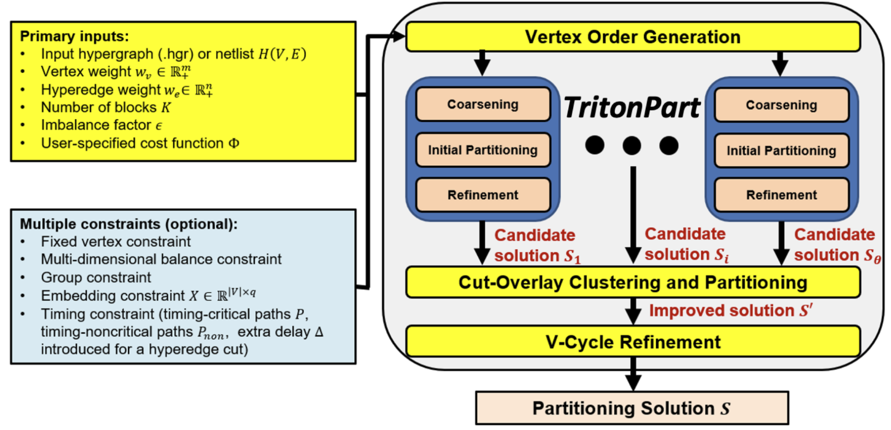

# TritonPart subproject  
## 引言
先前的VLSI hypergraph partition都只考虑了min-cut因素，而TritonPart将时序和资源异构纳入考量。**TritonPart**在如下三个方面相比先前的Sota有优势：  
1. 对于标准的min-cut划分，TritonPart相比[hMetis](http://ieeexplore.ieee.org/document/748202/)更有优势。
2. TritonPart是嵌入敏感的算法
3. TritonPart能够减少[关键路径](https://vlsi.kr/Slack/#:~:text=Definition%3A%20In%20a%20digital%20circuit,performance%20of%20the%20entire%20system.)被cut的数量，也能避免非关键路径变成关键路径。
4. TritonPart使用**多维度权重**，可以考虑flip-flops, LUTs, DSPs等多种资源的数量限制。

## 基本原理

## TritonPart的工作流

## 基准测试
论文中的基准测试，用Titan23 testbench，对比hMetis和KaHyPar这两个sota。

## 相关概念  
### [Embedding](https://ieeexplore.ieee.org/document/9169850)  
类比机器学习领域的单词嵌入，此处的graph中的每个vertex通过**embedding**的方式将vertex映射到高维度空间中（利用预先训练好的kernel函数？）。  
在最先提出用embedding做超图分割的论文中，是使用机器学习来学习出合适的embedding映射函数。

## References
1. [TritonPart论文](https://ieeexplore.ieee.org/abstract/document/10323975)
2. [OpenROAD talk](https://www.youtube.com/watch?v=z-yoZuJx2IE)
3. [OpenROAD 文档](https://openroad.readthedocs.io/en/latest/)
4. [slack 知识讲解](https://www.icdesigntips.com/2020/12/setup-and-hold-slack-explained.html)
5. [OpenRoad github项目](https://github.com/The-OpenROAD-Project/OpenROAD)