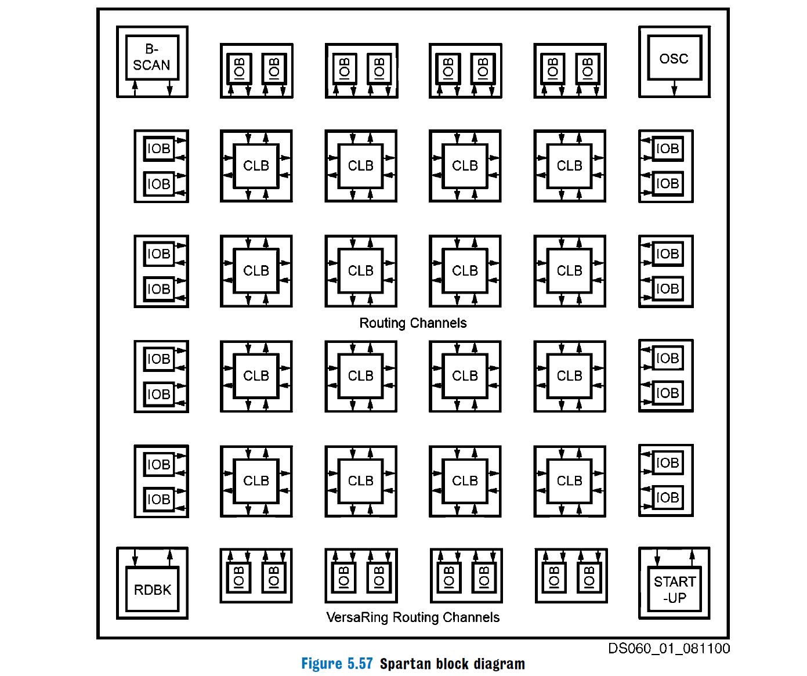

# FPGA Programming for the Masses
## Why FPGA? 
We have GPP(general-purpose processors) and ASICs(application-specific integrated circuits) before, but they are actually two extremes!   
* GPP processors are **highly programmable**, but **inefficient in terms of power and performance**.  
* ASICs are hard to change/reprogram.     

Here goes FPGA, a specialization of PLDs(programmable logic devices). FPGAs were long considered **low-volume, low-density ASIC replacements**, but not the case nowadays!. 
> FPGA runs at a clock frequency that is an order of magnitude lower than CPUs and GPUs (graphics processing units) is able to outperform them.

## FPGA architecture  
To sum up the architecturre, FPGA contains:  
* **LUTs** (look-up tables), which are used to implement combinational logic
* **FFs** (flip-flops), which are used to implement sequential logic. 
* FPGA also contains **discrete components** such as BRAMs (block RAMs), DSP (digital signal processing) slices, processor cores, and various communication cores (e.g., Ethernet MAC and PCIe).  
  

## Two kinds of Application 
1. **heterogeneous systems** targeted at HPC (high-performance computing) that tightly couple FPGAs with conventional CPUs
2. **midrange commercial-off-the-shelf workstations** that use PCIe-attached FPGAs

## References  
1. [论文网址](https://queue.acm.org/detail.cfm?id=2443836)