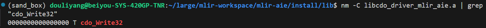

# Linker issues in large projects  

## Tools for linker problems
### nm command
```shell
T	text (code) segment symbol
t	static text segment symbol
R	read-only data segment symbol
r	static read-only data segment symbol
D	data segment symbol
d	static data segment symbol
B	bss segment symbol
b	static bss segment symbol
C	constant address
U	referenced but undefined symbol
```
That's how we use it to solve link lib problems? 

## References
1. CSAPP
2. [nm command](https://pkg.go.dev/cmd/nm)