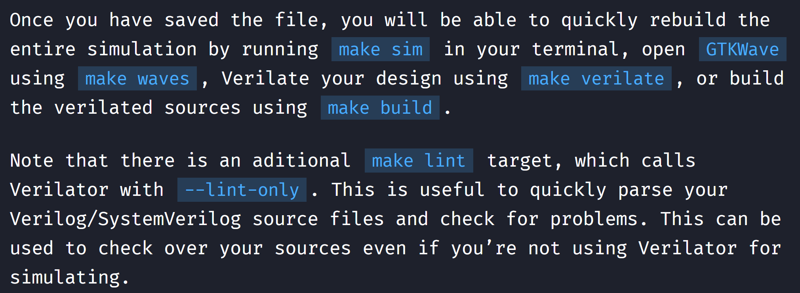

# Verilator tutorial
## Build from source 
安装verilator有两种方式，一种是包管理，一种是源码编译。由于一生一芯需要5.008版本的verilator来支持systemverilog，需源码编译（**apt-get的版本一般为4.x.y**）。  
1. git clone源代码，并checkout到指定版本。  
    ```shell
    git clone git@github.com:verilator/verilator.git
    git tag # 查看verilator有哪些版本
    git checkout v5.008 # checkout到指定版本
    ```
2. 安装prerequisite  
    ```shell
    sudo apt-get install git help2man perl python3 make autoconf g++ flex bison ccache
    sudo apt-get install libgoogle-perftools-dev numactl perl-doc
    sudo apt-get install libfl2  # Ubuntu only (ignore if gives error)
    sudo apt-get install libfl-dev  # Ubuntu only (ignore if gives error)
    sudo apt-get install zlibc zlib1g zlib1g-dev  # Ubuntu only (ignore if gives error)
    ```
3. unset环境变量  
    ```shell
    unset VERILATOR_ROOT
    ```
4. 源码编译  
    ```shell
    cd verilator
    autoconf # 创建 ./configure 脚本  
    ./configure --prefix=/usr # 阅读makefile会发现，安装的PREFIX路径默认是/usr/local/bin，如果想要直接安装在/usr/bin下，不能修改makefile，而是给配置脚本传参 
    make -j $(nproc)
    make install
    verilator --version
    ```

> 注意：verilator的build过程要10分钟左右，并且swapspace要开辟至少10个G的空间。详情查看[swapspace的配置](../Build_Install.md#交换空间)

## Learn from examples  
[Verilator tutorial](https://www.itsembedded.com/dhd/verilator_2/)中已经详细讲解了如何用makefile，verilator，cpp以及system verilog构建DUT的testbench。  
1. `SystemVerilog，描述顶层硬件以及verilator public类型`
    ```verilog
    /*
    * Primitive alu example for Verilator example
    *
    * File name: alu.sv
    * Author: Norbertas Kremeris 2021
    *
    */
    typedef enum logic [1:0] {
        add     = 2'h1,
        sub     = 2'h2,
        nop     = 2'h0
    } operation_t /*verilator public*/;

    module alu #(
            parameter WIDTH = 6
    ) (
            input clk,
            input rst,

            input  operation_t  op_in,
            input  [WIDTH-1:0]  a_in,
            input  [WIDTH-1:0]  b_in,
            input               in_valid,

            output logic [WIDTH-1:0]  out,
            output logic              out_valid
    );

            operation_t  op_in_r;
            logic  [WIDTH-1:0]  a_in_r;
            logic  [WIDTH-1:0]  b_in_r;
            logic               in_valid_r;
            logic  [WIDTH-1:0]  result;

            // Register all inputs
            always_ff @ (posedge clk, posedge rst) begin
                    if (rst) begin
                            op_in_r     <= nop;
                            a_in_r      <= '0;
                            b_in_r      <= '0;
                            in_valid_r  <= '0;
                    end else begin
                            op_in_r    <= op_in;
                            a_in_r     <= a_in;
                            b_in_r     <= b_in;
                            in_valid_r <= in_valid;
                    end
            end

            // Compute the result
            always_comb begin
                    result = '0;
                    if (in_valid_r) begin
                            case (op_in_r)
                                    add: result = a_in_r + b_in_r;
                                    sub: result = a_in_r + (~b_in_r+1'b1);
                                    default: result = '0;
                            endcase
                    end
            end

            // Register outputs
            always_ff @ (posedge clk, posedge rst) begin
                    if (rst) begin
                            out       <= '0;
                            out_valid <= '0;
                    end else begin
                            out       <= result;
                            out_valid <= in_valid_r;
                    end
            end

    endmodule;
    ```
2. `cpp testbench代码（verilator支持）`
    ```cpp 
    // Verilator Example
    // Norbertas Kremeris 2021
    #include <stdlib.h>
    #include <iostream>
    #include <cstdlib>
    #include <verilated.h>
    #include <verilated_vcd_c.h>
    #include "Valu.h"
    #include "Valu___024unit.h"

    #define MAX_SIM_TIME 300
    #define VERIF_START_TIME 7
    vluint64_t sim_time = 0;
    vluint64_t posedge_cnt = 0;

    void dut_reset (Valu *dut, vluint64_t &sim_time){
        dut->rst = 0;
        if(sim_time >= 3 && sim_time < 6){
            dut->rst = 1;
            dut->a_in = 0;
            dut->b_in = 0;
            dut->op_in = 0;
            dut->in_valid = 0;
        }
    }

    void check_out_valid(Valu *dut, vluint64_t &sim_time){
        static unsigned char in_valid = 0; //in valid from current cycle
        static unsigned char in_valid_d = 0; //delayed in_valid
        static unsigned char out_valid_exp = 0; //expected out_valid value

        if (sim_time >= VERIF_START_TIME) {
            out_valid_exp = in_valid_d;
            in_valid_d = in_valid;
            in_valid = dut->in_valid;
            if (out_valid_exp != dut->out_valid) {
                std::cout << "ERROR: out_valid mismatch, "
                    << "exp: " << (int)(out_valid_exp)
                    << " recv: " << (int)(dut->out_valid)
                    << " simtime: " << sim_time << std::endl;
            }
        }
    }

    void set_rnd_out_valid(Valu *dut, vluint64_t &sim_time){
        if (sim_time >= VERIF_START_TIME) {
            dut->in_valid = rand() % 2;
        }
    }

    int main(int argc, char** argv, char** env) {
        srand (time(NULL));
        Verilated::commandArgs(argc, argv);
        Valu *dut = new Valu;

        Verilated::traceEverOn(true);
        VerilatedVcdC *m_trace = new VerilatedVcdC;
        dut->trace(m_trace, 5);
        m_trace->open("waveform.vcd");

        while (sim_time < MAX_SIM_TIME) {
            dut_reset(dut, sim_time);

            dut->clk ^= 1;
            dut->eval();

            if (dut->clk == 1){
                dut->in_valid = 0;
                posedge_cnt++;
                set_rnd_out_valid(dut, sim_time);
                check_out_valid(dut, sim_time);
            }

            m_trace->dump(sim_time);
            sim_time++;
        }

        m_trace->close();
        delete dut;
        exit(EXIT_SUCCESS);
    }
    ```
3. `Makefile文件`
    ```MakeFile 
    # Verilator example makefile
    # Norbertas Kremeris 2021
    MODULE=alu

    .PHONY:sim
    sim: waveform.vcd

    .PHONY:verilate
    verilate: .stamp.verilate

    .PHONY:build
    build: obj_dir/Valu

    .PHONY:waves
    waves: waveform.vcd
        @echo
        @echo "### WAVES ###"
        gtkwave waveform.vcd

    waveform.vcd: ./obj_dir/V$(MODULE)
        @echo
        @echo "### SIMULATING ###"
        ./obj_dir/V$(MODULE) +verilator+rand+reset+2 

    ./obj_dir/V$(MODULE): .stamp.verilate
        @echo
        @echo "### BUILDING SIM ###"
        make -C obj_dir -f V$(MODULE).mk V$(MODULE)

    .stamp.verilate: $(MODULE).sv tb_$(MODULE).cpp
        @echo
        @echo "### VERILATING ###"
        verilator -Wall --trace --x-assign unique --x-initial unique -cc $(MODULE).sv --exe tb_$(MODULE).cpp
        @touch .stamp.verilate

    .PHONY:lint
    lint: $(MODULE).sv
        verilator --lint-only $(MODULE).sv

    .PHONY: clean
    clean:
        rm -rf .stamp.*;
        rm -rf ./obj_dir
        rm -rf waveform.vcd

    ```

理解该Makefile的最佳方式，就是先理解如果是用**命令行**，处理流程是： 
1. verilator -Wall --trace -cc alu.sv --exe tb_alu.cpp
2. make -C obj_dir -f Valu.mk Valu
3. ./obj_dir/Valu +verilator+rand+reset+2
4. gtkwave waveform.vcd

## References  
1. [verilator官网教学](https://www.veripool.org/verilator/)
2. [verilator github仓库](https://github.com/verilator/verilator)
3. [verilator 安装教程路径](https://verilator.org/guide/latest/install.html)
4. [verilator manual](https://veripool.org/guide/latest/)
5. [verilator 插件配置](https://soc.ustc.edu.cn/Digital-Pro/lab0/Verilator/)
6. [verilator 拓展教学](https://www.itsembedded.com/dhd/verilator_1/)
7. [gtkwave 手册](https://gtkwave.sourceforge.net/gtkwave.pdf)
